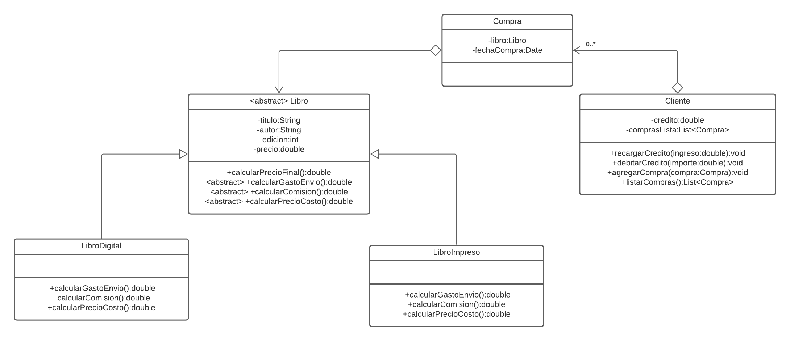

# G02 SE Ejercicio 02_02
### Ingegrantes:

- Álvarez Zhapa Carlos Daniel
- Sarmiento Basurto Douglas Bryan  
- Serpa Pulgarin Roberto Carlos 
- Zhizhpon Tacuri Cesar Eduardo 

## Aplicar el patrón de diseño Template Method 

### Problema - Requerimientos

- En un sitio de comercio electrónico se venden libros.  
- Los libros tienen: Título, Autor, Edición, Precio 
- Los libros a la venta pueden ser digitales o impresos. 
- El precio final de un libro digital es el precio de costo más un costo fijo por comisión; el precio final de un libro impreso tiene una comisión del 2% del costo y se agregan $20 de gastos de envío. 
- El sitio administra sus clientes: 
- Cuentan con un crédito para comprar libros. 
- Cuando un cliente compra un libro, se debita el precio de su crédito. 
- Pueden hacer recargas de su crédito. 
- Un cliente puede querer acceder a la lista de sus compras. 

### Resolución de preguntas

1. ¿Hay comportamiento en común? 

Con respecto a los tipos de libro, digitales e impresos, ambos tienen el comportamiento común acerca de cómo se calcula el precio final. Si bien tienen en común dicho cálculo, los parámetros involucrados de cada uno tienen diferentes valores. 

2. ¿Qué pasa si modifico algo en ese comportamiento común? 

Si se modificara este comportamiento común que existe entre los dos tipos de libros, a la larga esto puede afectar a los ingresos y egresos de la empresa ya que la lógica del comercio electrónico se ve afecta. En otras palabras, se daña la relación entre el sistema y las reglas de negocio de la empresa. 

3. ¿Hay alguna forma de factorizarlo al comportamiento común? 

Sí. La manera de factorizarlo es mediante el uso de patrones de diseño. Estos, permiten analizar conflictos o problemas de contexto dentro del sistema. En el caso de estudio que se presenta, a través de sus requerimientos, se evidencia un patrón en cuanto al cálculo del precio final. Por lo tanto, se usa el Template Method para solucionarlo de manera eficiente. 

4. ¿Qué pasa con el comportamiento distinto? 

El Template Method busca solucionar un patrón en el sistema, estableciendo una estructura predefinida de métodos abstractos. Las subclases que hereden dicha estructura podrán implementarlas a conveniencia de las mismas, para así poder ajustarse a la lógica de la empresa.

### Diseño para la solución del problema

